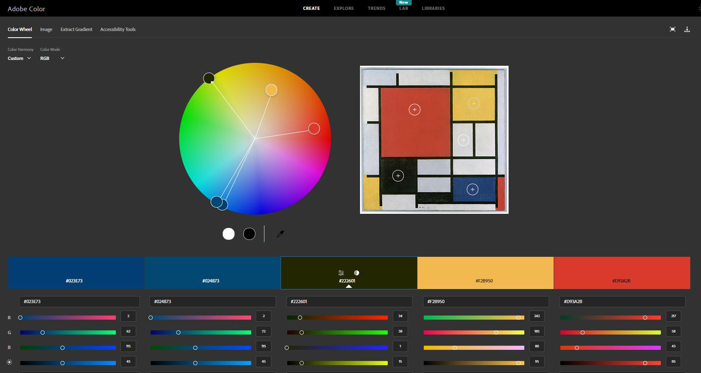
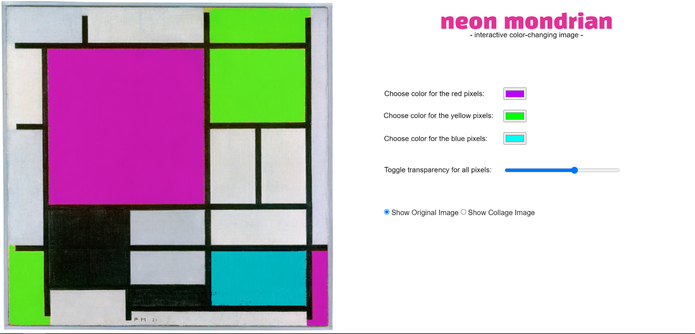
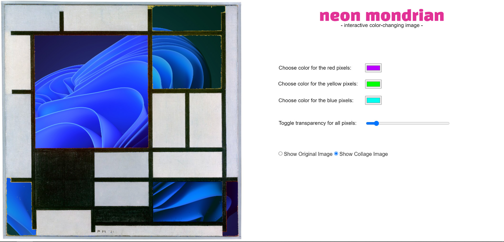
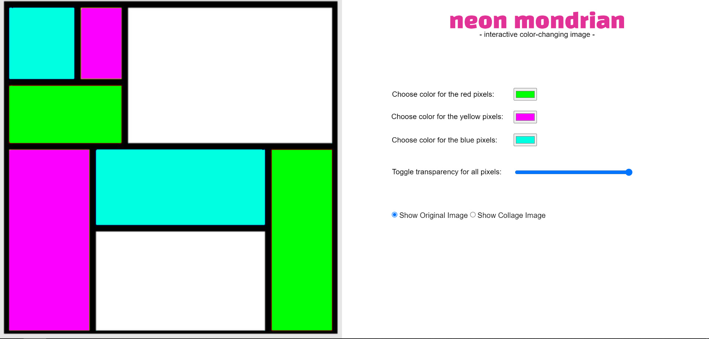
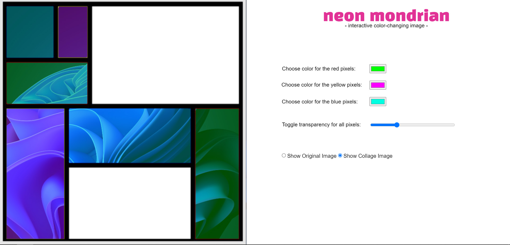
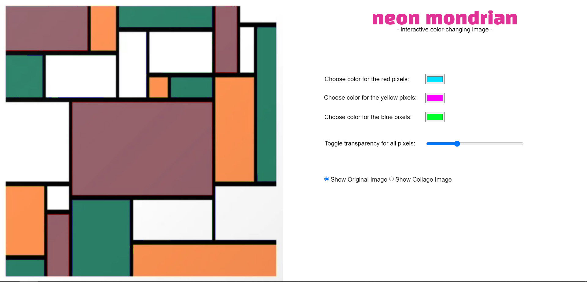
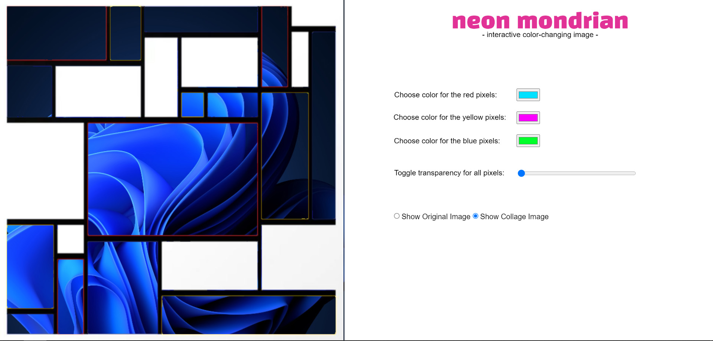

# ReadMe - HW08A Working Document

This assignment revolves around manipulating colors & alpha channels in Piet Mondrian paintings. I've set up a canvas to have two halves: the left consisting of the painting, and the right half consisting of handles to manipulate colors, transparency and image overlays.

❗❗ COLOR DETECTION MECHANISM ❗❗

I'm detecting colors using individual RGB ranges of all the hues involved. I had made use of *Adobe Color* to get the RGB values of the reds, blues & yellows present in the image. Using those, I've coded in a gamut that corresponds to each primary color.

<p align = "center">

<br>
Figure 1.1: Gathering RGB Values of Primary Hues - Adobe Color </p>

```
//detecting red color in duplicate image, and modifying pixel values
if((imgRedVal<=255 && imgRedVal>=175) && (imgGreenVal<=150 && imgGreenVal>=0) && (imgBlueVal<=255 && imgBlueVal>=0))

//detecting yellow color in duplicate image, and modifiying pixel values
if((imgRedVal<=255 && imgRedVal>=200) && (imgGreenVal<=255 && imgGreenVal>=100) && (imgBlueVal<=100 && imgBlueVal>=0))

//detecting blue color in duplicate image, and modifiying pixel values
if((imgRedVal<=100 && imgRedVal>=0) && (imgGreenVal<=100 && imgGreenVal>=0) && (imgBlueVal<=255 && imgBlueVal>=95))    
```

❗❗ COLOR & ALPHA CHANNEL MANIPULATION ❗❗

For changing the colors and alpha levels, I'm making use of DOM elements. For the "destination colors", I've utilized three color-pickers to get colors from the user in real-time. Similarly, for modifying the transparency or alpha levels, I'm making use of a DOM slider that goes from 0 to 255, enabling dynamic changes in opacity.

Additionally, I've stacked the original Mondrian and the edited version on top of each other so that user modifications can be seen at once. I've also made use of radio buttons to enable/disable a "collage image" that basically puts another image below the edited Mondrian painting. That way, any modification to the Mondrian results in a "window effect".

It's the Windows 11 dark-mode wallpaper, so quite literally, a *windows* effect. :P

<p align = "center">

<br>
Figure 2.1: Main Painting - Color Change
<br>
<br>

<br>
Figure 2.2: Main Painting - Alpha-Channel Modification </p>

❗❗ ADDITIONAL MONDRIANS - CODE EXECUTION ❗❗

I ran my code on other Mondrian images as well. Here are screenshots from those executions:

<p align = "center">

<br>
Figure 3.1: Alt Painting 1 - Color Change
<br>
<br>

<br>
Figure 3.2: Alt Painting 1 - Alpha-Channel Modification
<br>
<br>

<br>
Figure 3.3: Alt Painting 2 - Color Change
<br>
<br>

<br>
Figure 3.4: Alt Painting 2 - Alpha-Channel Modification </p>